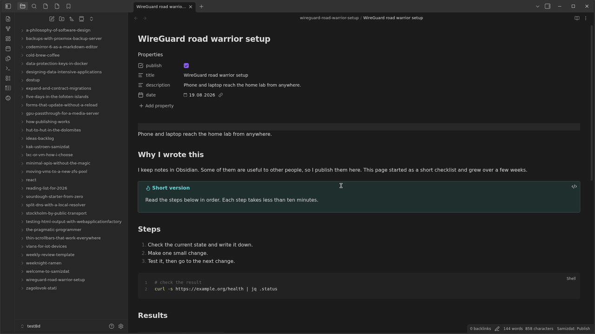

# Samizdat

Publish your Obsidian notes as a private web site. You keep the password, and you give each
article its own link that expires.

**Status: it works. You build it from the source. There is no package yet.**

<p>
  
</p>

## What it does

You write notes in Obsidian. You mark a note with `publish: true`. One command sends the note to
your own server. The server keeps the Markdown, makes the HTML page, and shows the page only to
the people you allow.

- The whole site is behind a login form.
- Each article can get a link with a time limit. You can revoke the link.
- Your notes stay yours. The server runs on your own machine.
- The server keeps the Markdown source, so you can change the theme or get the note back.

## What works now

- **Publish from the vault.** The `push` command sends the notes that have `publish: true`.
  It can remove from the server the notes that you deleted (`--prune`), and it can show the plan
  first (`--dry-run`). The `pull` command reads one note back.
- **Pages.** The server makes the HTML on request and keeps it in a cache. It shows wiki links,
  image embeds, callouts and code with colors.
- **Navigation.** The side bar shows the folder tree of your vault, with a filter by title.
- **Users.** The owner makes the accounts. An article is private, or it is open to all the users
  of the site. A reader sees the titles of the private articles, but not their text.
- **Links for other people.** An article can get a link with a term of one day, one week, one
  month, one year, or with no term. The link opens one article to a person who has no account.
  The owner sees how many times the link was opened, and can revoke it.
- **Search.** Full text search with Russian morphology: the query `серверы` finds the word
  `сервер`. You can search for a phrase in quotes, and you can remove a word with a minus sign.
  Each result shows the words you looked for. If the search finds nothing, it looks for similar
  words, because you can make a mistake when you type.
- **Backlinks.** Each article shows the articles that mention it.
- **Look.** Two color schemes, a gallery of backgrounds, and your own picture as the background.
  The themes are files, so you can add your own directory.
- **Language.** The interface speaks English or Russian. The owner sets the language of the site,
  and each user can set a different language for their own pages. A language is a file, so you can
  add one more.

Not there yet: a ready image in a registry and the packages. See "How to run it".

## Why

Each part of this is common. The set is not:

| Tool | Static output | Editor | Login for the site | Link to one article |
|---|---|---|---|---|
| Obsidian Publish | yes | Obsidian | site only | no |
| Quartz, Perlite, Hugo | yes | Obsidian | no | no |
| Outline, Docmost, BookStack | no, app and database | their own | yes | yes |
| **Samizdat** | server-rendered | Obsidian | yes | **yes, with a time limit** |

Obsidian Publish gives one password for the full site. Users asked for per-note links since 2021.
Static site generators have no login at all. Wiki applications have the links, but you must write
in their editor.

## Design

- **Source of truth is your vault.** The server keeps a copy of the published notes. The `push`
  command replaces that copy. The server does not edit your notes, so there is no merge conflict.
- **Markdown on disk** (`data/articles/<slug>/index.md` and the attachments next to it).
  PostgreSQL keeps the metadata, the users, the links and the search index.
- **HTML is made on request** and cached. A new theme needs no rebuild.
- **The slug is the address.** The folder of the note is a separate field, so you can move a note
  between folders and the links still work.
- **Search is in the database.** PostgreSQL makes the search vectors from the title, the
  description and the text. The rights are part of the query, so a reader cannot find the text of
  a private article.
- **A language is a file.** `en` and `ru` are in the program. Put a file `<code>.json` into
  `<data root>/lang/` and that language comes into the list in the settings. A file with a code
  that the program knows replaces only the lines that it contains; the other lines stay. A line
  that no file gives comes from `en`.

## How to run it

### With Docker

You need Docker with the Compose plugin and git. The image is built on your server from the source code.

```bash
git clone https://github.com/bolikcraft/samizdat.git /opt/samizdat
cd /opt/samizdat
cp .env.example .env        # then set POSTGRES_PASSWORD in .env
deploy/update.sh            # builds the image and starts the site and the database

docker compose run --rm app owner set <login> <password>
docker compose run --rm app token new laptop
```

The site is at `http://<server>:8080`. To change the port or the address, set `SAMIZDAT_PORT` and
`SAMIZDAT_BIND` in `.env`. The folders `data/` (articles, keys, background) and `pgdata/`
(the database) are in the same folder as `compose.yaml`. `docker compose down -v` does not remove them.

A new database has the demo account `admin` with the password `admin`. The command `owner set` with
a different login removes this account if its password is still `admin`.
If a person with the login exists, `owner set` gives this person the new password and makes this person an owner.

The database uses `POSTGRES_PASSWORD` only when it starts for the first time with an empty `pgdata/`.
After that, do not change the password in `.env` only. First change it in the database, then in `.env`.

To update, run `deploy/update.sh` again. Before the update, the script writes a dump of the database
to `backups/` and keeps the last 10 dumps. If the database is stopped, the script starts it for the dump.
Then the script gets the new version, builds the image and waits until the site starts (at most 5 minutes).
Without an argument, the script updates to `origin/main`. To go to another version, give the script
a git ref — a commit or a tag: `deploy/update.sh <ref>`. If the update fails, the script shows
the command that goes back to the previous version.
The database changes of each version only add data, so an earlier version works with the new database.

The dump contains only the database. It does not contain `data/` (articles, keys, background).
For a full copy, also copy the folder `data/`, or make a snapshot of the machine.

To restore the database from a dump:

```bash
docker compose stop app
# pg_restore --clean does not remove tables that are not in the dump, so remove all tables first.
docker compose exec -T db psql -U samizdat -d samizdat -c 'DROP SCHEMA public CASCADE; CREATE SCHEMA public;'
docker compose exec -T db pg_restore -U samizdat -d samizdat < backups/<file>.dump
docker compose start app
```

Behind a reverse proxy with HTTPS, the proxy must send the header `X-Forwarded-Proto: https`.
Without it, the login cookie does not get the `Secure` flag.

### From the source code

You need the .NET 10 SDK and a PostgreSQL server (version 14 or later).

```bash
# 1. Give the server the address of the database (or use the Postgres connection string
#    in the configuration file appsettings.xml).
dotnet user-secrets --project src/Samizdat.Server \
  set "ConnectionStrings:Postgres" "Host=localhost;Database=samizdat;Username=samizdat;Password=..."

# 2. Start the server. It makes the tables itself.
dotnet run --project src/Samizdat.Server --no-launch-profile -- \
  --urls http://127.0.0.1:5080 --Samizdat:DataRoot=/path/to/data

# 3. Set the owner and make a token for the command line tool.
dotnet run --project src/Samizdat.Server --no-launch-profile -- owner set <login> <password>
dotnet run --project src/Samizdat.Server --no-launch-profile -- token new laptop

# 4. Tell the tool where the server and the vault are, then publish.
dotnet run --project src/Samizdat.Cli -- login
dotnet run --project src/Samizdat.Cli -- push --dry-run
dotnet run --project src/Samizdat.Cli -- push
```

The command `reindex` makes the search index again for all the articles. You need it only after
an update that changes how the text is read.

You can also publish from Obsidian itself: the plugin is in the repository
[samizdat-obsidian](https://github.com/bolikcraft/samizdat-obsidian). It works on a phone, and the
command line tool does not.

## Stack

.NET 10 (ASP.NET Core Minimal API), EF Core with Npgsql, PostgreSQL, Markdig for Markdown,
Scriban for the themes, a command line tool for `push` and `pull`.

## License

MIT
